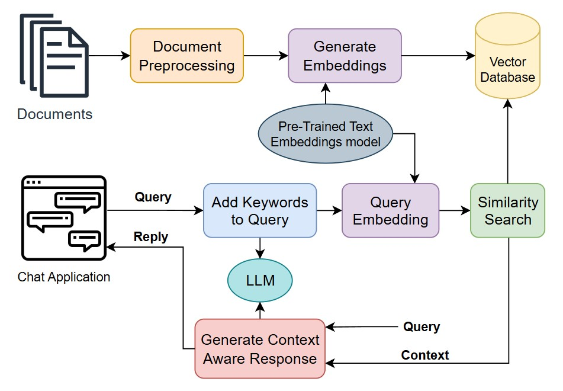

## RAG Chat Application for Document Knowledge Querying
#### An interactive RAG application chatbot where users can upload documents, and query from them to get context and extract knowledge.

This  RAG chatbot application has a front end and a back end. The front end has an interactive chat interface where users can chat and upload documents to the knowledge base. The back end handles all the data processing, including document indexing in vector db, querying the database, and generating context-aware reply responses using LLM.

### The RAG chat application architecture is depicted as follows:

### RAG chat application workflow:

1. Input documents and preprocessing: 
- This step includes steps parsing documents, cleaning them, and chunking or splitting documents into smaller, manageable chunks.
- The chunks should be meaningful, not splitting across important boundaries.
- Then metadata addition such as titles and tags to those chunks to provide context.

2. Creating a Knowledge base:
- Use a pre-trained text embedding model (open source) to convert each chunk into embeddings.
- The store these embeddings with their corresponding metadata and original text in a vector database (Chromadb)

3. Querying the Knowledge Base:
- Input Query: A user submits a natural language query that needs context or answers in the chatbot
- Create a set of keywords using LLM that is relevant to the query that carries the same semantics for a better similarity search
- Query Embedding: Convert the user's query into a semantic embedding using the same text embedding model used for the documents.
- Keyword Embeddings: Convert generated helper keywords also into semantic embeddings

4. Similarity Search:
Use the query embeddings to search the vector database for the most semantically similar document chunks. The database retrieves the top-N chunks based on cosine similarity or other distance metrics.

5. Generating Context-Aware Responses
Combine Context: The retrieved document chunks (context) are combined with the user query, which forms the input for the language model.
- LLM Generation: Pass the combined input to a pre-trained LLM. The LLM generates a response incorporating the retrieved context to provide more accurate and relevant answers.
- Maintain a conversation history to memorize that earlier chat context.

6. Reply to the user
- The generated natural language response is sent to the user as a reply in the chatbot.

### Technologies Used
TODO
### How to Use
TODO
